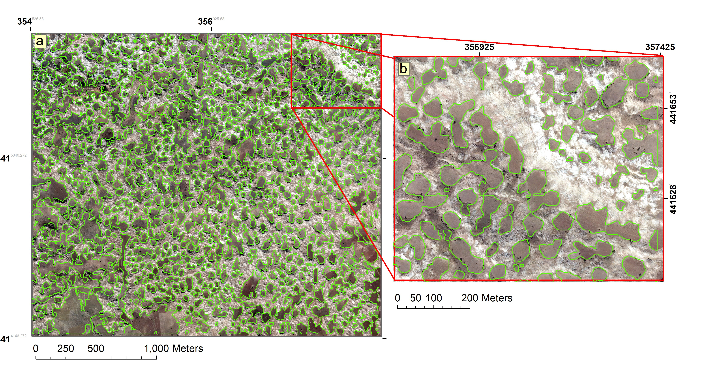

# Dolin-Segmentation-UNet
In this study, the Segmentation Models library (https://github.com/qubvel/segmentation_models) was used to segmentation processes with transfer learning.

* image and mask data were created.
* patches were created
* İmages not including doline were deleted
* dataset were created as train, validation and test
* segmentation (U-Net model)
* prediction of new area
* creating .shp file (vector data)

  

Figure showes predicted dolines from orthophoto for a new area.
